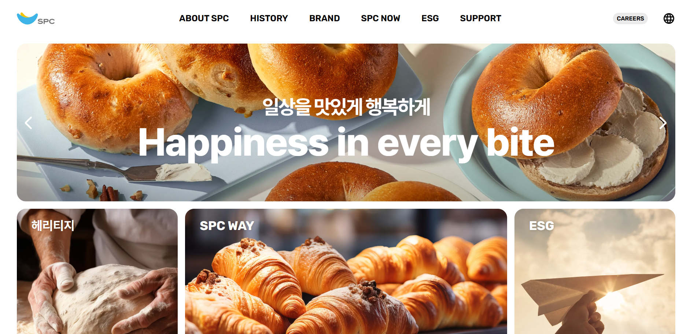
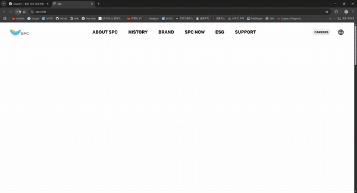
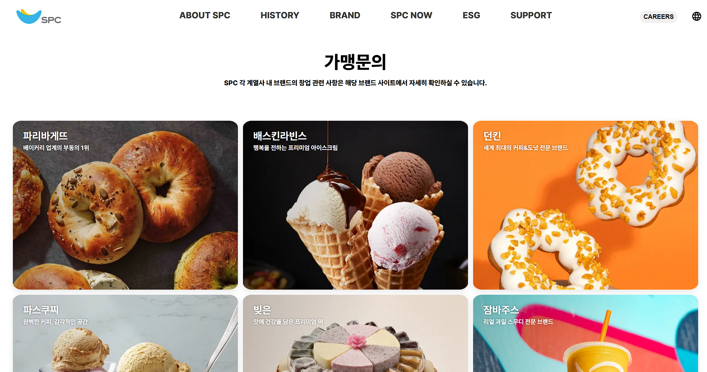
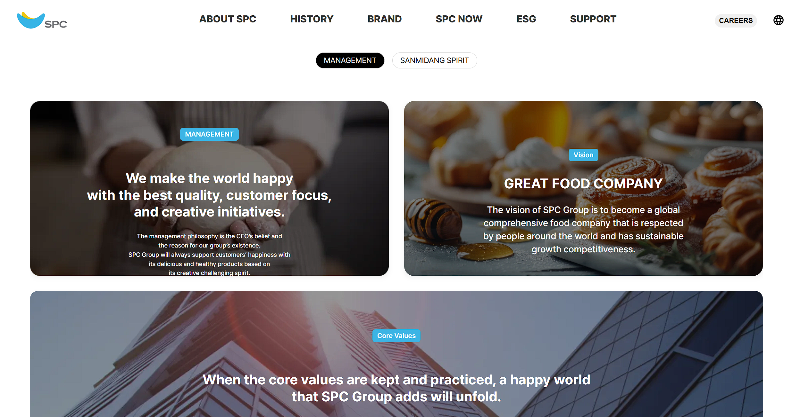
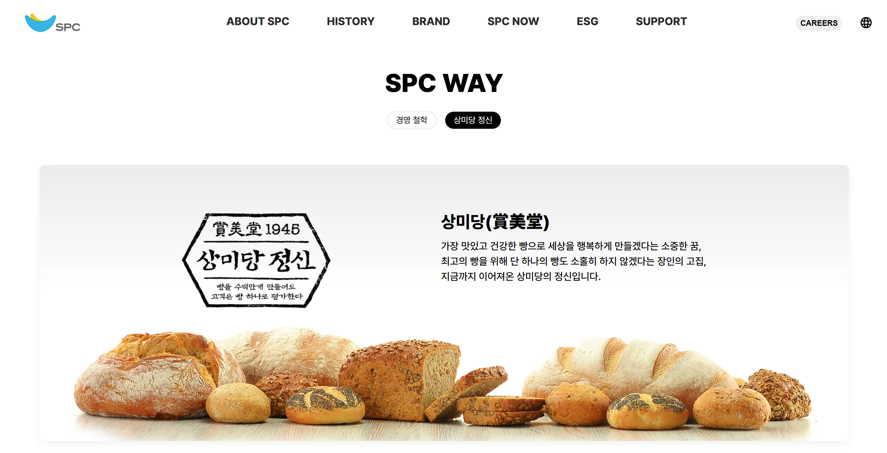
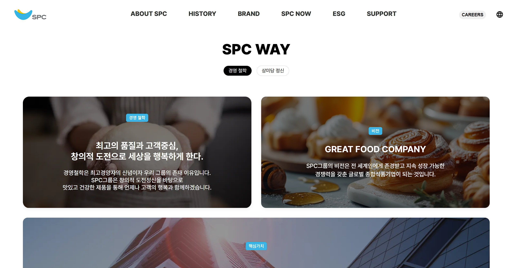
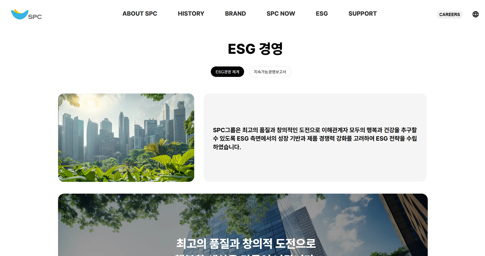

# SPC 웹 클론 코딩 프로젝트2

## 개요

**_프로젝트명_**: spc website clone

**_프로젝트 기간_**: 2025-04-14 ~ 2025-04-16

**_팀장:_** 주영찬

**_팀원:_** 이은혁, 나석후, 구현희

## 개발 환경

- Programming Languages: React, Javascript
- Chrome
- git, github

## 기획서

- 사이트 선정 사유 : 프론트 프로젝트라서 시각적인 요소를 중요하게 생각했는데 전체적으로 미니멀하면서도 정보 전달이 명확한 레이아웃이 시선을 끌었습니다. 이를 클론 제작하면서 UI 구성 연습과 디자인 구축 능력을 키울 수 있을 것 같았고 호버 효과, 슬라이더 등 다양한 인터랙션 요소들이 포함되어 있어 프론트엔드 구현 연습에 적합하다고 느꼈습니다. 페이지 간 이동이 구분되어 있어 라우팅 기능 구현에도 연습이 될 것 같아서 선정하게 되었습니다.

- 원본 사이트 주소 https://www.spc.co.kr/

  

- 클론한 페이지 : Main Page, ABOUT SPC, ESG, SUPPORT

- 프로젝트 목표는 React 기반 웹 개발 실력 향상, 실제 서비스 구조를 분석하고 구현함으로써 컴포넌트 설계, 상태 관리, 라우팅 등
  React 핵심 기술의 실전 적용 능력을 기르기, 디자인 시스템과 UI 구성 능력 강화입니다.

- 일정 계획 https://docs.google.com/spreadsheets/d/1_FgvwLlSDRLuiT1HNP0PlhnFXni2Vo0w6oDZlcEdaJY/edit?gid=0#gid=0

## 구현한 SPA 사이트 주소 

- https://meow-nyang.github.io/team2-react-clone/

## 요구사항 정의서

- https://docs.google.com/spreadsheets/d/1ReRhyIJEG-NC298EsH2l-PHaJy-ahWPUo5n69usneC8/edit?gid=0#gid=0

## 소스코드

- github에 업로드 완료.

## 테스트 케이스

- https://docs.google.com/spreadsheets/d/1OZd4xMyAOcGIATD5_dMIX67qgMTdET1doouybZqLZTU/edit?gid=0#gid=0

## 테스트 결과

  
  - 메인화면 진입 시 동적 애니메이션 구현 테스트   
  
  - 가맹문의 사이트 진입 시 이미지 레이아웃 및 호버 기능 테스트   
  
  - 페이지 언어 변경 시 메뉴 및 컨텐츠 언어가 실제로 변경 되는지 테스트   
  
  - 버튼 탭 클릭 시 각 화면 렌더링 테스트   
  
  - 버튼 탭 클릭 시 각 화면 렌더링 테스트   
  

  - ESG 경영 페이지 정상 렌더링 여부 테스트   

## 한계점

- 시간이 부족해서 디테일한 부분 완성도가 아쉬움.

- 메인 화면 전체를 구현하지 못함.

- 번역 기능을 전부 넣지 못함.

## 회고

- React와 SCSS에 대한 이해 부족으로 어려움을 느꼈고, 프론트엔드 개발 역량을 더 키워야겠다고 느꼈음. React는 처음 다뤄보는 만큼, 기초부터 차근히 학습할 필요성을 느꼈음.

- Javascript 기반 언어라서 자바스크립스에 대한 기초를 확실히 다져야겠다고 생각했습니다. SCSS 디자인이 생각보다 훨씬 어려웠습니다.
